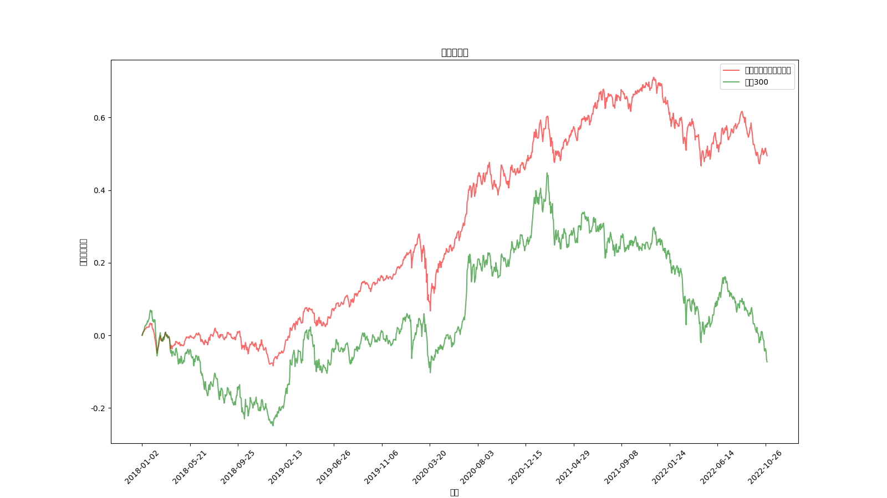

# 1. 项目概述

**本项目为基金组合定投回测工具，不构成投资建议！**

项目是博主想实现躺赢的基金组合投资工具^ ^。
博主的基金投资理念是指数基金长期价值定投，买大盘指数，分散投资，优先保住本金。



## 1.1 分散投资
- 分散到不同的品类：例如沪深300、中证500、创业板；
    - 像沪深300是沪深股市表现最好的300家企业，代表了中国经济，稳定，但是收益可能相对低一些，可以多配置一些；
    - 中证500是中国证券市场表现最好的500家企业，范围更广一些；
    - 创业板是中国股市创业型企业，冲劲大，代表中国经济未来的新势力，风险高，收益也高，可以少配置一些
    - 黄金指数是跟踪实物黄金价格的基金，俗话说：乱世买黄金，盛世买股票，股市表现不好的时候，黄金可能表现好
    - 债权指数是跟踪国债的基金，是组合基金的不动基石，在其他价值标的表现不好的时候，也不至于整体表现太差；
- 分散到不同的国家：中国、美国(标普500、纳斯达克100)等
    - 标普500，美国市场表现最好的500家企业
    - 纳斯达克100，科技企业大多在纳斯达克上市，价值你知道的
- 目前博主的基金组合配比大致为
    - 沪深300 25%
    - 中证500 15%
    - 创业板  10%
    - 黄金  10%
    - 债权 20%
    - 标普500 15%
    - 纳斯达克100 5%

    博主没有测试更多份额比例，可以自行测试。

    还可以测试更多组合，例如基金组合的典型组合：永久组合、60/40组合、斯文森组合、全天候组合等。
    

## 1.2 定期再平衡
基金组合创建时不同的基金会有不同的份额，再运行一段时间后，份额会发生变化，有点基金可能涨了很多，有点基金可能会跌了一些，有的人买基金不挣钱的原因是什么，不会卖，涨的钱又流出去了。
股市是有周期的，涨涨跌跌，潮起潮落，通过定期再平衡，将运行一段时间的基金份额重新配置为初始份额比例，变相的实现了高卖低买的目的，实现了削尖平谷的目的，挣取更多超额收益。

再平衡周期建议1年操作一次，这样可以减少费用。

# 2. 使用指南
## 2.1 启动运行
### 2.1.1 方式一
直接打开CSDN 云IDE自动运行：[https://idegitcode.net/RobotFutures/1024](https://idegitcode.net/RobotFutures/1024)

### 2.1.2 方式二
- 从gitcode下载源码
```
git clone https://gitcode.net/RobotFutures/1024.git
```

- 启动运行
```
pip install -r requirements.txt&&python fund_portfolio_backtesting_tool.py
```

## 2.2 目录结构
```
├── CHANGELOG.MD                        # 修订记录
├── README.md                           # 使用文档
├── fund_fee_list.csv                   # 爬取的公募基金交易费用
├── fund_portfolio_backtesting_tool.py  # 基金组合回测工具程序
├── log.txt                             # 日志输出
├── package.json    
├── preview.yml                         # 自动启动运行脚本配置
├── requirements.txt                    # 项目所需库
├── src
├── 公募基金概要数据.csv                 # 下载的公募基金概要数据，包含交易费用
├── 回测结果                             # 回测计算结果
    └── 2022-11-06_01-23-39             # 回测时间
        ├── fund_portfolio_result.csv   # 基金组合清单及份额占比
        ├── fund_portfolio_trend.png    # 基金组合与沪深300对比
        ├── 沪深300基金参考.csv          # 沪深300参考基金历史数据
        └── 自选组合基金回测数据.csv     # 基金组合回测历史数据
├── 基金关键字筛选结果                   # 大盘基金关键字及策略筛选结果
├── 基金组合筛选结果列表                 # 筛选结果基金性能指标
├── 累计净值趋势                         # 下载的公募基金累计净值历史数据       
└── 累计回报趋势                        # 下载的公募基金累计回报历史数据    
```

## 2.3 回测结果展示
- 回测结果可视化展示


- 自选组合基金
```
Unnamed: 0,code,years,withdrawal,annual_return,total_return,sharp,calmar,volatility,name,type,scale,m_fee,c_fee,sale_fee,sub_fee,total_fee,share
16.0,002670,6.11,27.34,6.74,37.02,0.46,12.9743,19.4,万家沪深300指数增强A,股票指数,6.34,1.0,0.12,0.0,0.1,1.22,0.25
97.0,502000,7.55,29.38,9.81,57.14,0.62,18.3793,20.16,西部利得中证500指数增强A,股票指数,5.08,1.0,0.2,0.0,0.1,1.3,0.15
3.0,001879,5.42,37.64,12.36,75.57,0.59,16.5217,26.3,长城创业板指数增强A,股票指数,6.58,1.0,0.15,0.0,0.15,1.3,0.1
4.0,002610,6.43,20.27,7.04,38.89,0.65,15.5788,12.22,博时黄金ETF联接A,联接基金,8.27,0.5,0.1,0.0,0.06,0.66,0.1
134.0,002864,6.38,0.61,3.38,17.41,10.81,224.7164,0.32,广发安泽短债债券A,债券型,28.99,0.3,0.1,0.0,0.04,0.4399999999999999,0.2
4.0,050025,10.39,31.17,11.3,67.75,0.65,17.4237,20.85,博时标普500ETF联接A,QDII-指数,8.87,0.6,0.25,0.0,0.12,0.97,0.15
5.0,161130,5.37,28.32,13.13,81.43,0.66,23.5765,25.47,易方达纳斯达克100人民币,QDII-指数,7.36,0.8,0.25,0.0,0.12,1.17,0.05

```

# 3. 自建组合
找到代码的这个位置
```
if __name__ == "__main__":
    pd.set_option('display.max_rows', 1000)
    pd.set_option('display.max_columns', 10)

    # 获得公募基金基础数据(这里不用管，执行即可)
    df_base = get_fund_base_info()

    # 大盘基金筛选(这里就是基金筛选策略)
    # 筛选策略是关键字、最大历史回测，基金成立时间、基金最小规模、基金最大允许的交易费率
    # 可支持的关键字很多，从基金的分类通用关键字即可，例如半导体、新能源、量化等
    df_kpi_csi300 = get_fund_rank(fund_list=df_base, keywords='沪深300', max_withdrawal=60.0, establish_year=5, start='2018-01-01', end='2022-10-31')
    df_kpi_csi500 = get_fund_rank(df_base, '中证500', 50.0, 5, '2018-01-01', '2022-10-31')
    df_kpi_gem = get_fund_rank(df_base, '创业板', 50.0, 5, '2018-01-01', '2022-10-31')
    df_kpi_gold = get_fund_rank(df_base, '黄金', 50.0, 5, '2018-01-01', '2022-10-31')
    df_kpi_bond = get_fund_rank(df_base, '债', 30.0, 5, '2018-01-01', '2022-10-31')
    df_kpi_sp500 = get_fund_rank(df_base, '标普500', 50.0, 5, '2018-01-01', '2022-10-31')
    df_kpi_nasda = get_fund_rank(df_base, '纳斯达克', 50.0, 5, '2018-01-01', '2022-10-31')

    # 定投基金组合回测
    fund_portfolio_backtesting(
        # 这里填写上面获得基金分类数据集
        fund_kinds_list = [df_kpi_csi300, df_kpi_csi500, df_kpi_gem, df_kpi_gold, df_kpi_bond, df_kpi_sp500, df_kpi_nasda],
        # 这里配置对应上面的基金份额
        fund_share_cfg = [0.25, 0.15, 0.10, 0.10, 0.20, 0.15, 0.05],
        # 这里填写回测起始时间和结束时间，参考跟踪基金
        start_date = '2018-01-01', end_date = '2022-10-31', fund_id_ref = '160706'
    )
```

# 4. 联系我
关注作者更多消息，请订阅博客[https://blog.csdn.net/RobotFutures?spm=1010.2135.3001.5343](https://blog.csdn.net/RobotFutures?spm=1010.2135.3001.5343)

- 基金组合价值定投技术交流请联系博主


---


## 一、大赛介绍

代码开发随着云计算技术的不断发展，云 IDE 能够帮助开发者聚焦业务逻辑，简化应用开发难度，提升软件研发效率。云 IDE 应用挑战赛是由 CSDN 自主策划的轻量级挑战赛事。参赛者可在 CSDN 的云 IDE 上（[https://ide.csdn.net](https://ide.csdn.net)）自动拉取代码并在线运行、预览、提交代码，赛事所有的事项都可以在云 IDE 内一站式完成。比赛不对作品提交形式作限制，参赛者可以尽情发挥自己的想象力。

## 二、参赛对象

大赛面向全社会开放，个人、高等院校、科研单位、企业等人员均可报名参赛。

说明：如有大赛主办方和技术支持单位（如 CSDN 员工）参赛，则自动放弃获奖资格。

## 三、赛事安排

|  赛程   | 时间  |
|  ----  | ----  |
| 参赛报名及提交作品  | 2022.10.23 - 2022.11.06 |
| 作品评选  | 2022.11.07 - 2022.11.14 |
| 评选结果公布  | 2022.11.15 |
| 奖励发放  | 2022.11.16 - 2022.11.22 |

## 四、奖项设置

|  奖项   | 奖品  | 人数 |
|  ----  | ----  | ---- |
| 一等奖  | **奖金 ¥5000 元** + 10核 10G 云实验环境会员 -1年| 1 |
| 二等奖  | **奖金 ¥2000 元** + 10核 10G 云实验环境会员 -1年 | 2 |
| 三等奖  | **奖金 ¥1000 元** + 10核 10G 云实验环境会员 -1年 | 5 |
| 优秀奖  | **奖金 ¥100 元** + 10核 10G 云实验环境会员 -1年 | 80 |
| 参与奖  | 10核 10G 云实验环境会员 -1个月 | 前10000名参赛者可得 |

注：一年10核10G云实验环境会员，非云服务器，是云容器实验环境，详细介绍[戳我查看](https://mydev.csdn.net/product/pod/new)。

## 五、参赛要求

1. 开发者可根据自己情况选择业界知名开源项目进行自行开发，或自研可开源项目结合GitCode和Cloud IDE进行开发与适配，作品要求必须能通过 CSDN 的云 IDE 内置的预览功能，在云 IDE 内预览。（CSDN 的云IDE：[https://ide.csdn.net](https://ide.csdn.net)）。作品可以是任何小应用（如外卖H5、个人主页）；小游戏（如 2048、五子棋）；各类特效（如 three.js、前端动画）等。

2. 未满 18 周岁的报名者，请在报名前征得有法定监护权的监护人的同意。

3. 参赛作品不存在抄袭等行为。

4. 除参与奖外，获奖人员，领奖时需实名认证，1 个实名认证用户仅可领取1份奖项。

## 六、报名及参赛流程

1. **进入 1024 云 IDE 应用挑战赛页面：[https://gitcode.net/cloud-ide/1024](https://gitcode.net/cloud-ide/1024)** 。**Fork 该项目，即参与比赛**。

2. **参赛后，将 Fork 的项目在云 IDE 中打开，并在云IDE中完成您自己的作品，提交代码。**

在云IDE提交代码，有2种操作方法，任选其一即可：

**方法一：**

> (1) 访问 [https://ide.csdn.net](https://ide.csdn.net) ，新建工作空间，仓库地址填写 克隆 的 Git 地址（操作方法：点击”克隆“，复制 ”通过SSH Clone项目“ 的链接）
>  
> 
> 
> 
> （2）填写 SSH 的 Git 地址，并将云 IDE 提供的 SSH Key （操作方法：[https://dev-ide.csdn.net/doc#git_commit](https://dev-ide.csdn.net/doc#git_commit) ）绑定到自己的 GitCode SSH 密钥中 [https://gitcode.net/-/profile/keys](https://gitcode.net/-/profile/keys)


**方法二：**

> (1) 直接在 Fork 的 GitCode 域名前加 ide 进入，例如 https://gitcode.net/xxxxx/1024 修改为 https://idegitcode.net/xxxxx/1024
> <br/>
> 
> 
> (2) 提交代码时，云 IDE 会让用户输入 CSDN 的账号和密码（即手机号+密码）

**3. 提交代码后，即可等待CSDN官方进行评选。** 2022.11.07 - 2022.11.14为作品评选时间，2022.11.15公布评选结果。
<br/>Tips：如果您想要分享下 云IDE 的使用感受，欢迎投稿[ 云IDE测评征文 ](https://activity.csdn.net/creatActivity?id=10239)活动，还能获得额外奖品哦~


## 七、评选规则

由评选委员会根据获得的 Star、作品复杂程度、易用性、新颖性等多角度评选。 

1. Star 占比 20%

    a. 获得 Star 的数量，1 颗即为 1 分，最高 20 分封顶

2. 作品复杂程度占比 40%

    a. 作品完整度

    b. 代码简洁，代码可读性强

    c. 架构清晰

    d. 作品难度，如使用了一些高级 API，比如 WebGL、Canvas

3. 易用性占比 30%

    a. 作品配套的说明，如果项目介绍、如果使用等

    b. 交互体验，产品具有较好的交互体验，有足够的易用性

    c. 可用，代码能在 CSDN 的云 IDE 上完整运行

4. 新颖性占比 10%

    a. 新颖性，使用了较为新颖的技术实现

## 八、领奖规则

1. 获奖名单会在该评选结束后在该页面公布。

2. 工作人员将在活动结束后的7个工作日内，通过CSDN私信联系中奖用户，进行发奖，请您注意消息通知。

## 九、赛事交流

1、如果您想要分享下 云IDE 的使用感受，欢迎投稿[ 云IDE测评征文 ](https://activity.csdn.net/creatActivity?id=10239)活动，还能获得额外奖品哦~

2、参赛选手官方交流群（仅作为选手之间讨论和交流）。扫码进入选手沟通群。大赛重要节点通知会在群内第一时间告知，请所有报名选手务必加群


## 十、其他说明

若出现以下情况，将视为违规，大赛组委会有权取消用户参赛资格及获得的奖项。

1. 参赛报名信息虚假，或不符合大赛报名要求的参赛者。

2. 参赛作品涉嫌抄袭，侵犯他人知识产权等行为。

3. 参赛期间或参赛作品发现或被举报认定存在的其他违法、违规行为。

法律允许范围内的，最终解释权归 CSDN 所有。

<div style="height:200px"></div>

